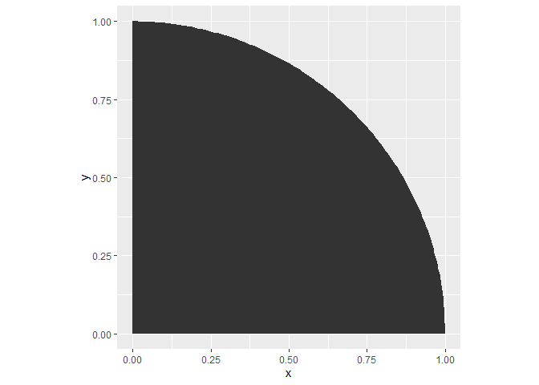
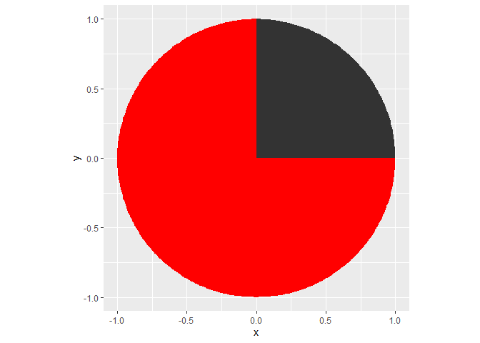

<!-- README.md is generated from README.Rmd. Please edit that file -->

# ggpolar

<!-- badges: start -->

<!-- badges: end -->

ggpolar supplies a few ggplot2 facilities to plot data in polar
coordinates on a cartesian layer.

## Highlights

  - You can map radius and theta on a cartesian layer directly, and draw
    the polar coordinates based plots intuitively.
  - You can translate and/or rotate the data (even data in cartesian
    coordinates\!) and/or the whole layer.
  - ggpolar can interpolate data automatically, so you are able to draw
    arcs and sectors as easily as draw lines and polygons.
  - ggpolar would not supply many layer functions, it tries to modify
    the layers\! So you can plot data in polar coordinates on the layers
    in ggplot2 package and other extension packages.

## Installation

By now, ggpolar has not been submitted to cran. You can try the
development version from [GitHub](https://github.com/):

``` r
# install.packages("devtools")
devtools::install_github("microly/ggpolar")
```

## Usage

1.You can map radius and theta to a layer directly.

``` r
library(tibble)
library(ggplot2)
library(ggpolar)

polar_data <- tibble(theta = 1:360, radius = theta)

# use StatPolar
ggplot(polar_data) + 
    geom_path(aes(p_theta = theta, p_radius = radius), stat = "polar")
```


``` r

# use with_polar, which is a layer modifier
ggplot(polar_data) + 
    with_polar(geom_path(aes(p_theta = theta, p_radius = radius)))
#> Warning: Ignoring unknown aesthetics: p_theta, p_radius
```


``` r

# the way to suppress the warning "Ignoring unknown aesthetics: p_theta, p_radius":
ggplot(polar_data, aes(p_theta = theta, p_radius = radius)) + 
    with_polar(geom_path())
```


2.You can also translate and/or rotate the data.

``` r
ggplot(polar_data, aes(p_theta = theta, p_radius = radius)) + 
    with_polar(geom_path(),
               geom_path(aes(polar_x = 200, polar_y = 200, polar_theta0 = 180)))
#> Warning: Ignoring unknown aesthetics: polar_x, polar_y, polar_theta0
```


3.Data can be interpolated automatically, so you can draw arcs and
sectors as easily as draw lines and polygons.

``` r
# you define the start and end points
polar_data2 <- tibble(theta = c(0,90), radius = 1)

# ggpolar will automatically interpolate other points.

# an arc example
ggplot(polar_data2, aes(p_theta = theta, p_radius = radius)) + 
    with_polar(geom_path(), interpolate = TRUE) + 
    coord_equal()
```


``` r

# a sector example
ggplot(polar_data2, aes(p_theta = theta, p_radius = radius)) + 
    with_polar(geom_polygon(), interpolate = TRUE, add_origin = TRUE) + 
    coord_equal()
```



``` r

# ggpolar can even make the supplement geometry for you! 
ggplot(polar_data2, aes(p_theta = theta, p_radius = radius)) + 
    with_polar(geom_polygon(), interpolate = TRUE, add_origin = TRUE) +
    with_polar(geom_polygon(fill = "red"), interpolate = TRUE, 
               supplement = TRUE, add_origin = TRUE) +
    coord_equal()
```



4.With the help of some layer functions (geom\_plar\_axis,
geom\_polar\_ring and geom\_polar\_bar), you can draw the polar
coordinates based plots (eg. radar plot, pie chart and Nightingale rose
diagram) in a more intuitively way.

``` r

# I will add some examples later.
```
